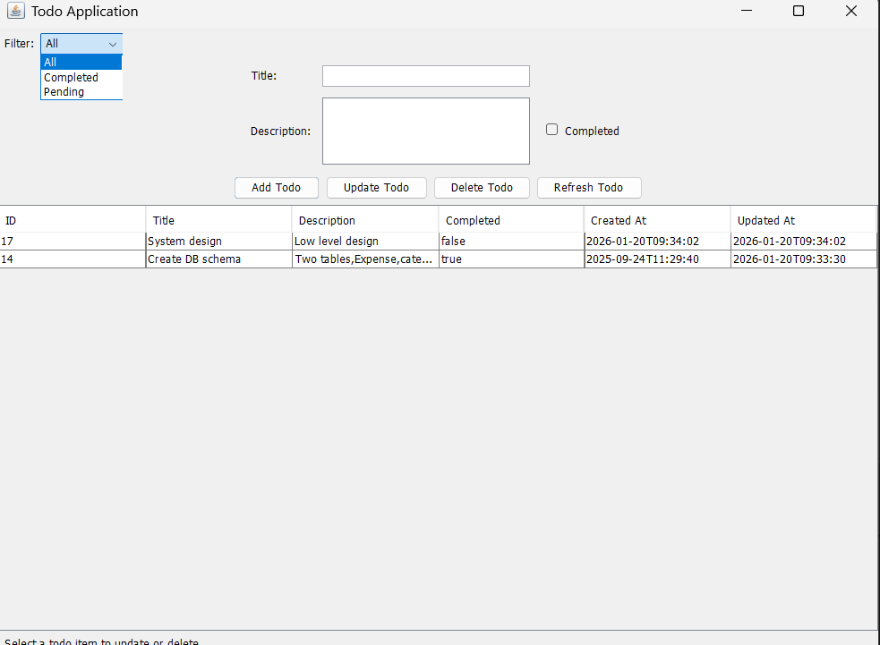

# Todo Application

A desktop task management application built with Java Swing and MySQL for organizing and tracking your daily todos.

## Table of Contents

- [Overview](#overview)
- [Features](#features)
- [Technology Stack](#technology-stack)
- [Prerequisites](#prerequisites)
- [Installation](#installation)
- [Database Setup](#database-setup)
- [Configuration](#configuration)
- [Usage](#usage)
- [Project Structure](#project-structure)
- [Building the Application](#building-the-application)
- [Contributing](#contributing)
- [License](#license)

## Overview

The Todo Application is a Java-based desktop application that helps users manage their tasks efficiently. With an intuitive graphical interface, users can create, update, delete, and filter todos while tracking completion status and timestamps. The application uses MySQL for persistent storage and follows the MVC architectural pattern.

## Screenshots



## Features

### Task Management
- **Create Todos**: Add new tasks with title and description
- **Update Todos**: Modify existing task details and completion status
- **Delete Todos**: Remove completed or unwanted tasks
- **Mark as Complete**: Toggle completion status with a checkbox

### Filtering & Organization
- **Filter by Status**: View all tasks, only completed tasks, or pending tasks
- **Chronological Ordering**: Tasks sorted by creation date (newest first)
- **Quick Search**: Easy table-based browsing

### Tracking & Timestamps
- **Creation Timestamp**: Automatically records when each task was created
- **Update Timestamp**: Tracks when tasks were last modified
- **Status Tracking**: Visual indication of completed vs pending tasks

### User Interface
- **Clean Swing GUI**: Intuitive desktop interface
- **Table View**: All tasks displayed in an organized table
- **Form Inputs**: Easy-to-use input fields for task details
- **Single Row Selection**: Select tasks to update or delete
- **Status Bar**: Helpful hints and instructions

## Technology Stack

- **Language**: Java 24
- **GUI Framework**: Java Swing
- **Database**: MySQL 8.0.33
- **Build Tool**: Apache Maven
- **Database Driver**: MySQL Connector/J 8.0.33
- **Architecture**: MVC Pattern with DAO Layer

## Prerequisites

Before running the application, ensure you have the following installed:

- **Java Development Kit (JDK)**: Version 24 or higher
  - Download from [Oracle](https://www.oracle.com/java/technologies/downloads/) or [OpenJDK](https://openjdk.org/)
  - Verify installation: `java -version`
  
- **Apache Maven**: Version 3.6 or higher
  - Download from [Maven Official Site](https://maven.apache.org/download.cgi)
  - Verify installation: `mvn -version`
  
- **MySQL Server**: Version 8.0 or higher
  - Download from [MySQL Official Site](https://dev.mysql.com/downloads/mysql/)
  - Ensure MySQL service is running

## Installation

### 1. Clone the Repository

```bash
git clone <repository-url>
cd TodoApp
```

### 2. Install Dependencies

Maven will automatically download required dependencies:

```bash
mvn clean install
```

## Database Setup

### 1. Create Database

Open MySQL command line or MySQL Workbench and execute:

```sql
CREATE DATABASE todo;
USE todo;
```

### 2. Create Table

Execute the following SQL to create the todos table:

```sql
CREATE TABLE todos (
    id INT AUTO_INCREMENT PRIMARY KEY,
    title VARCHAR(255) NOT NULL,
    description TEXT,
    completed BOOLEAN DEFAULT FALSE,
    create_at TIMESTAMP DEFAULT CURRENT_TIMESTAMP,
    update_at TIMESTAMP DEFAULT CURRENT_TIMESTAMP ON UPDATE CURRENT_TIMESTAMP
);
```

### 3. Insert Sample Data (Optional)

```sql
INSERT INTO todos (title, description, completed) VALUES 
    ('Complete project documentation', 'Write comprehensive README and API docs', FALSE),
    ('Review pull requests', 'Review and merge pending PRs on GitHub', FALSE),
    ('Update dependencies', 'Check for security updates and new versions', TRUE),
    ('Prepare presentation', 'Create slides for team meeting', FALSE),
    ('Code review meeting', 'Attend weekly code review session', TRUE);
```

## Configuration

### Database Credentials

Update the database connection settings in `src/main/java/com/todo/util/DatabaseUtil.java`:

```java
private static final String URL = "jdbc:mysql://localhost:3306/todo?useSSL=true&serverTimezone=UTC";
private static final String USER = "your_mysql_username";
private static final String PASSWORD = "your_mysql_password";
```

**Important Security Note**: For production use, move credentials to environment variables instead of hardcoding them.

### Recommended: Using Environment Variables

1. Create a `.env` file in the project root:

```env
DB_URL=jdbc:mysql://localhost:3306/todo?useSSL=true&serverTimezone=UTC
DB_USER=your_mysql_username
DB_PASSWORD=your_mysql_password
```

2. Add `.env` to `.gitignore` to prevent committing credentials

## Usage

### Running the Application

#### Option 1: Using Maven

```bash
mvn exec:java
```

#### Option 2: Using Compiled JAR

```bash
# Build the JAR file
mvn package

# Run the JAR
java -jar target/todo-application-1.0.0.jar
```

### Application Workflow

#### 1. Adding a Todo

1. Enter the task title in the "Title" field (required)
2. Add a description in the "Description" area (optional)
3. Check the "Completed" checkbox if the task is already done
4. Click "Add Todo" button
5. The new task appears in the table

#### 2. Viewing Todos

- **All Todos**: The table displays all tasks by default
- **Filter Options**: Use the dropdown at the top to filter:
  - **All**: Show all tasks
  - **Completed**: Show only completed tasks
  - **Pending**: Show only pending tasks

#### 3. Updating a Todo

1. Click on a todo row in the table to select it
2. The task details will populate the input fields
3. Modify the title, description, or completion status
4. Click "Update Todo" button
5. Confirm the update in the success dialog

#### 4. Deleting a Todo

1. Click on a todo row in the table to select it
2. Click "Delete Todo" button
3. Confirm the deletion in the success dialog
4. The task is removed from the table

#### 5. Refreshing the View

- Click "Refresh Todo" to reload all tasks from the database
- Resets the filter to show all tasks
- Clears the input form

### Keyboard Navigation

- Use arrow keys to navigate through the table
- Tab to move between input fields
- Enter to submit forms (when focused on buttons)

## Project Structure

```
TodoApp/
├── pom.xml                              # Maven configuration
├── README.md                            # This file
├── .gitignore                           # Git ignore rules
├── src/
│   └── main/
│       └── java/
│           └── com/
│               └── todo/
│                   ├── Main.java        # Application entry point
│                   ├── dao/
│                   │   └── TodoDao.java # Data Access Object
│                   ├── gui/
│                   │   └── TodoAppGUI.java  # Swing GUI
│                   ├── model/
│                   │   └── Todo.java    # Todo entity model
│                   └── util/
│                       └── DatabaseUtil.java # Database utility
└── target/                              # Compiled output (generated)
```

## Building the Application

### Development Build

```bash
# Compile the project
mvn compile

# Run tests (if available)
mvn test

# Package as JAR
mvn package
```

### Creating Executable JAR

The project uses `maven-shade-plugin` to create an executable JAR with all dependencies:

```bash
mvn clean package
```

The executable JAR will be created at: `target/todo-application-1.0.0.jar`

### Running the JAR

```bash
java -jar target/todo-application-1.0.0.jar
```

## Troubleshooting

### Common Issues

**Database Connection Failed**
- Ensure MySQL server is running: `sudo service mysql start` (Linux) or check Services on Windows
- Verify database credentials in `DatabaseUtil.java`
- Check if `todo` database exists: `SHOW DATABASES;`
- Confirm port 3306 is accessible

**JDBC Driver Not Found**
- Run `mvn clean install` to download dependencies
- Verify MySQL Connector is in `pom.xml`
- Check Maven repository cache: `~/.m2/repository`

**Application Won't Start**
- Check Java version: `java -version` (must be 24+)
- Verify Maven build completed successfully
- Check console for error messages
- Review database connection logs

**Table Not Found Error**
- Ensure `todos` table is created in the database
- Run the SQL schema provided in Database Setup
- Verify you're connected to the correct database

**GUI Not Displaying Properly**
- Update graphics drivers
- Try running with different look and feel
- Check display scaling settings

## Code Structure

### Main Components

**Main.java**
- Entry point of the application
- Initializes database connection
- Sets system look-and-feel
- Launches the GUI

**Todo.java (Model)**
- Entity class representing a todo item
- Fields: id, title, description, completed, create_at, update_at
- Includes validation and business logic

**TodoDao.java (Data Access Layer)**
- Database operations for todos
- Methods: create, read, update, delete
- Filtering by completion status
- Prepared statements for SQL injection prevention

**TodoAppGUI.java (View/Controller)**
- Swing-based user interface
- Event handling for user actions
- Table display with filtering
- Form inputs and validation

**DatabaseUtil.java (Utility)**
- Database connection management
- JDBC driver initialization
- Connection pooling support (future enhancement)

## Contributing

Contributions are welcome. To contribute:

1. Fork the repository
2. Create a feature branch: `git checkout -b feature/your-feature`
3. Make your changes
4. Test thoroughly
5. Commit your changes: `git commit -m 'Add some feature'`
6. Push to the branch: `git push origin feature/your-feature`
7. Create a Pull Request

### Code Style Guidelines

- Follow Java naming conventions
- Use meaningful variable and method names
- Add JavaDoc comments for public methods
- Keep methods focused and concise
- Use proper exception handling
- Write unit tests for new features

## Future Enhancements

- Add priority levels (High, Medium, Low)
- Implement due dates with calendar picker
- Add categories/tags for better organization
- Create recurring tasks functionality
- Implement search and advanced filtering
- Add data export (CSV, JSON, PDF)
- Include task statistics and analytics dashboard
- Multi-user support with authentication
- Dark mode theme option
- Notification system for due tasks
- Drag-and-drop reordering
- Subtasks/checklist support

## License

This project is open source and available under the [MIT License](LICENSE).

## Support

For issues, questions, or suggestions:
- Open an issue on the GitHub repository
- Contact the maintainer

## Acknowledgements

- Built with [Java Swing](https://docs.oracle.com/javase/tutorial/uiswing/)
- Database powered by [MySQL](https://www.mysql.com/)
- Build automation with [Apache Maven](https://maven.apache.org/)

---

**Last Updated**: January 19, 2026
